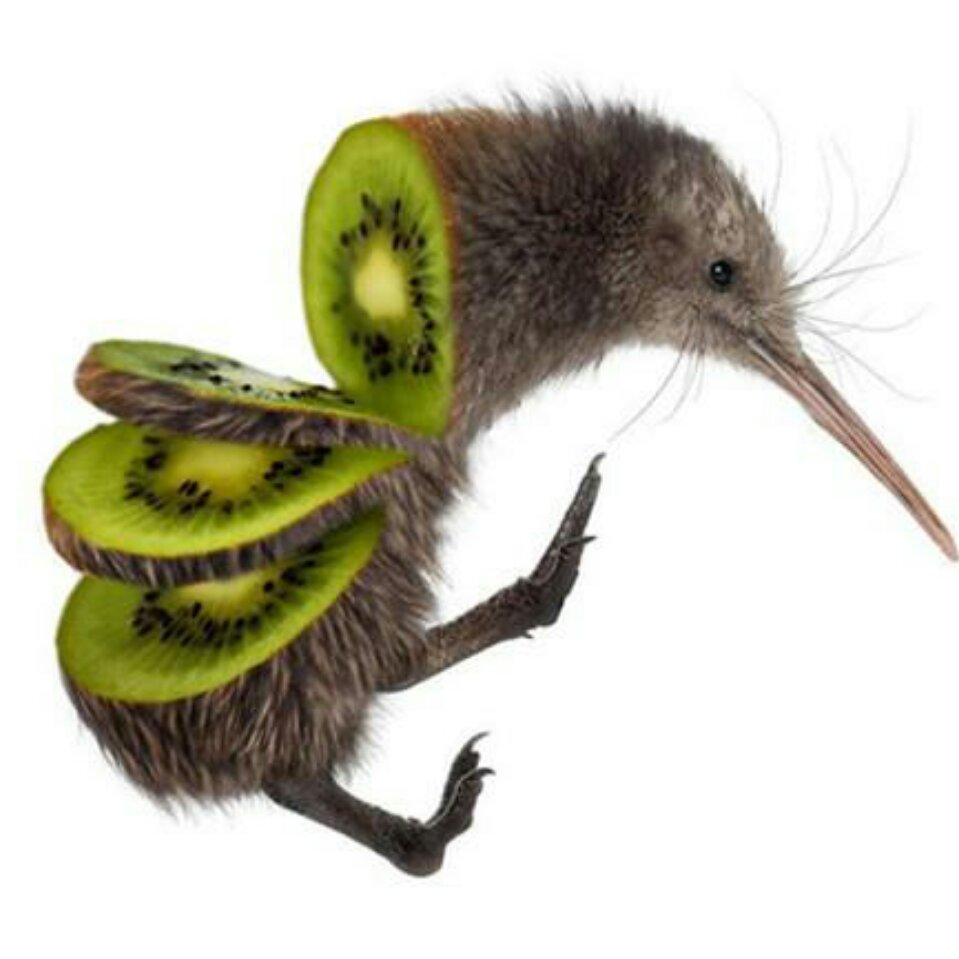

# r3kapig
[中文](./index-zh.md)  [English](./index.md)

&nbsp;&nbsp;&nbsp;&nbsp;r3kapig战队成立于2018年，由老牌CTF战队Flappypig和强劲新锐战队Eur3ke联合组成。战队愿景是成为国际知名CTF战队。

&nbsp;&nbsp;&nbsp;&nbsp;我们的成员擅长领域十分广泛，从自然地理到高性能计算，从电子商务到理论物理，他们来自五湖四海，从千年古都西安到浪漫土耳其，从上海滩到加州公路，从首都北京到日本东京，都有r3kapig成员忙碌的身影。退役队员也将自己的精力和智识投入阿里巴巴、腾讯、京东、奇虎360等等知名公司。

&nbsp;&nbsp;&nbsp;&nbsp;战队成立之初就崭露头角，成立当年就挺进Defcon总决赛，并在次年再次成功入围Defcon27决赛。国内赛场同样披荆斩棘，完成了XCTF四连冠的傲人战绩。战队多次打进国际比赛决赛，包括HITCON CTF、Nuit do hack和Dragon CTF等。另外，战队还在2019年0CTF国际赛中拔得头筹，创造了中国大陆战队在0CTF中的最好成绩。

&nbsp;&nbsp;&nbsp;&nbsp;未来,r3kapig战队将继续在CTF赛场中努力，同时也欢迎有理想有技能的人加入我们，一起为更安全的未来努力。

&nbsp;&nbsp;&nbsp;&nbsp;官方邮箱：root@r3kapig.com ，欢迎一起交流学习。
 

# 战队成员

> Give me a point, I can lift a flappy pig.
>
> These are our members.

 

## 活跃成员

| | |
| --------------------------------------------------------- | ------------------------------------------------------------ |
|  | **Anciety**(Leader) Peking University - Runtime CTF Cheerleader - Github: [Anciety](//github.com/Escapingbug) |
|     | **Bibi** (Leader) - Blog: [http://beafb1b1.github.io/](http://beafb1b1.github.io/) - Github: [beafb1b1](//github.com/beafb1b1)                                           |
|      | **Atum**  Peking University - Blog: [http://atum.li/about/](http://atum.li/about/) - Github: [a7um](//github.com/a7um) |
|    | **Mxny**    Work in MaiXiangTech   - Blog: [http://mxny.org](http://mxny.org) |
|     | **Ne0** B.S in Nanjing University & PhD in Georgia Tech - Blog: [https://changochen.github.io/](//changochen.github.io/about.html) - Github: [Changochen](//github.com/changochen) |
|  | **Ricter** 初❤️を忘れず - Blog: [https://ricterz.me/](//ricterz.me/)  - Github: [RicterZ](//github.com/RicterZ) |
|   | **Swings**  Focus on Vulnerability Discovering &Active in CTF, PWN/Reverse - Blog: [https://bestwing.me/](//bestwing.me/) - Github: [WinMin](//github.com/WinMin) |
|   | **Nonick** Uneducated - Blog: [http://127.0.0.1/](http://127.0.0.1/) - Github: [unamer](//github.com/unamer) |
|   | **NightShadow** A vegetables chicken, following swings and pizza - Blog: [whklhhhh](http://blog.csdn.net/whklhhhh)|
|   | **f1sh** Hacked by Swings - Blog: [http://f1sh.site/](http://f1sh.site/)|
|   | **stypr** Master at Sleeping. Working in Tokyo. - Blog: [https://harold.kim/](//harold.kim/) - Github: [stypr](//github.com/stypr)|
|  |**zzm** Web Security & Machine Learning Follower of Ricter and Chromium1337 - Blog: [http://zzm.cat](http://zzm.cat) - Github: [zhazhami](//github.com/zhazhami) |
|  |**一叶飘零** Web Security &  Follower of Ricter and Chromium1337 - Blog: [https://skysec.top/](//skysec.top/)|
|  |**Oroggs** A vegetables chicken, following swings and pizza and  NightShadow - Blog: [https://blog.oroggs.xyz/](//blog.oroggs.xyz/)|
|  |**n0b0dy** Web security & privacy - Blog: [https://n0b0dycn.me/](//n0b0dycn.me/)|
| |**yuguorui** Peking University, Crypto, Pwn - Github: [yuguorui](//github.com/yuguorui)|
|  |**Auxy** Pass Cut-Off & Noob in Program Analysis - Blog: [https://auxy.xyz](https://www.auxy.xyz/)|
| |**liangjs** Juicy Kiwi - Github: [liangjs](//github.com/liangjs)|
| |**Pizza** Reverse|
| | **Rex** Yet another pig in r3kapig. - Github: [xiao-xing-yun](//github.com/xiao-xing-yun)|
| | **w1tcher** No pwn, No Swings. 
| | **lowkey** Just to convince the reviewer.  |
|  |**LFY** Web dog, most vegetablest in r3kapig. - Blog: [https://lfysec.top/](//lfysec.top/)|
|   | **Umut**  Pwn and reverse. - Blog: [https://pwndiary.com](//pwndiary.com) - Github: [umutoztunc](//github.com/umutoztunc) |

 

## 历史活跃成员

| | |
| :----------------------------------------------------: | :---------------------------------------------------------- |
|  | **Jarvis** White hat, full stack, embedded engineer, IoT security researcher  - Blog: [https://www.jarviswang.me/](//www.jarviswang.me/)|
|    | **1phan**   B.S in Xidian University & PhD in IUB  - Blog: [http://www.1phan.cc](http://www.1phan.cc) - Github: [Gao-Chuan](//github.com/Gao-Chuan) |
|   | **Processor** No pwn, no reverse. - Blog: [https://processor.pub/](//processor.pub/)|

 

# 战队成绩

|                 Game Name                            |           Time            |
| ---------------------------------------------------- | ------------------------: |
| Real World CTF 5th 4th place | Online,Jan.2023 |
| TetCTF 2023 6th place | Online,Jan.2023 |
| ASIS CTF Finals 2022 7th place | Online,Dec.2022 |
| N1CTF 2022 6th place | Online,Nov.2022 |
| ASIS CTF Quals 2022 5th place | Online,Oct.2022 |
| CyberSecurityRumble CTF 2022 3rd place | Online,Oct.2022 |
| DownUnderCTF 2022 (Online) 5th place | Online,Sep.2022 |
| CTFZone 2022 4th place | Online,Aug.2022 |
| WMCTF 2022 1st🏆place | Online,Aug.2022 |
| corCTF 2022 5th place | Online,Aug.2022 |
| Azure Assassin Alliance CTF 2022 4th place |Online,June.2022|
| TyphoonCon CTF 2022 1st🏆place |Online,June.2022|
| justCTF 2022 6th place |Online,June.2022|
| SEETF 2022 1st🏆place |Online,June.2022|
| Security Fest 2022 1st🏆place |Online,June.2022|
| DEF CON CTF Qualifier 2022 13th place |Online,May.2022|
| VolgaCTF 2022 Qualifier 6th place |Online,May.2022|
| Securinets CTF Final 2022 3rd place |Online,May.2022|
| sixsarCTF 2022 9th place |Online,Apr.2022|
| Securinets CTF Quals 2022 6th place |Online,Apr.2022|
| UTCTF 2022 3rd place |Online,Mar.2022|
| D^3CTF 2022 7th place |Online,Mar.2022|
| Codegate CTF 2022 Preliminary 10th place |Online,Feb.2022|
| Ugra CTF Quals 2022 6th place |Online,Feb.2022|
| DefCamp CTF 21-22 Online 3rd place |Online,Feb.2022|
| Real World CTF 4th place |Online,Jan.2022|
| SCTF 2021 8th place |Online,Dec.2021|
| SECCON CTF 2021 8th place |Online,Dec.2021|
| N1CTF 2021 2nd place |Online,Nov.2021|
| L3HCTF 2021 4th place |Online,Nov.2021|
| Hack.lu CTF 2021 5th place |Online,Oct.2021|
| 0CTF/TCTF 2021 Finals 2nd place |Online,Sep.2021|
| WMCTF 2021 3rd place |Online,Aug.2021|
| 0CTF/TCTF 2021 Quals 4th place |Online,July.2021|
| DEF CON CTF Qualifier 2021 5th place |Online,May.2021|
| Real World CTF 3rd 7th place |Online,Jan.2021|
| HackTM CTF Finals 2020 3th place |Online,Dec.2020|
| N1CTF 2020 2nd place |Online,Oct.2020|
| 0CTF/TCTF 2020 Finals 4th place |Online,Sep.2020|
| CyBRICS CTF 2020 4th place |Online,July.2020|
| 0CTF/TCTF 2020 Quals 4th place |Online,June.2020|
| HackTM CTF Quals 2020 4th place |Online,Feb.2020|
| N1CTF 2019 5th place|Online,Sep.2019|
| DEFCON 27 CTF Final, 2019 10th place                 |Las Vegas, NV, USA, Aug. 2019|
| WCTF 2019 Onsite(Master), 3rd place	               | Beijing, China, July. 2019 |
| 0CTF/TCTF 2019 Final, 1st🏆place                     |Shanghai, China, June. 2019 |
| RCTF 2019 Online, 1st🏆place                         |         Online, May. 2019 |
| *CTF 2019 Quals, 1st🏆place                          |       Online, April. 2019 |
| 0CTF/TCTF 2019 Quals, 5th place                      |       Online, March. 2019 |
| Trend Micro CTF 2018 Finals, 4th place               |   Tokyo, Japan, Dec. 2018 |
| Real World CTF 2018 Finals, 5th place                |Zhengzhou, China Dec. 2018 |
| BCTF 2018, 1st🏆place                                |         Online, Nov. 2018 |
| XCTF 2018 FINALS -HITB BEIJING, 1st🏆place           | Beijing, China, Nov. 2018 |
| Hack. lu CTF 2018, 3rd place                          |         Online, Oct. 2018 |
| RCTF 2018 Online, 4th place                          |         Online, Oct. 2018 |
| Nuit du Hack CTF Quals 2018, 5th place (JD-r3kapig)  |         Online, Oct. 2018 |
| DEFCON 26 CTF Final, 18th place                      | Las Vegas, USA, Aug. 2018 |
| Real World CTF 2018 Quals, 3rd place                 |        Online, July. 2018 |

... more available at <a href="//ctftime.org/team/58979">ctftime</a>.

