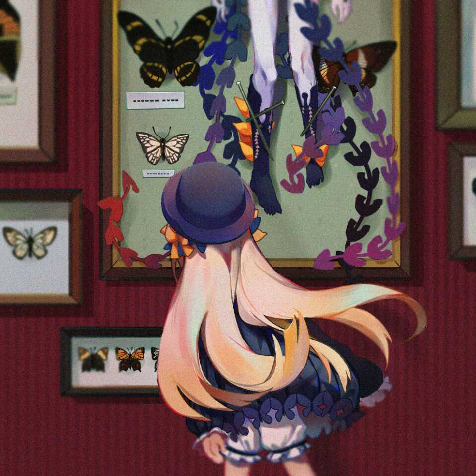

# r3kapig

r3kapig is a united CTF Team mostly emerges from Eur3kA and FlappyPig since 2018. And just so you know, r3kapig is a delicious dish that can be grilled and fried, and the mission of the team is to provide the most delicious food for the host. :P

We actively participate in online and on-site CTF competitions. You can browse our recently participated events and ranks on CTFtime. We are a group of cybersecurity enthusiasts interested in various areas including software security, web security, cryptography, IoT security, etc. 

 

# Team Members

> Give me a point, I can lift a flappy pig.
>
> These are our members.

 

## Active Members

| | |
| --------------------------------------------------------- | ------------------------------------------------------------ |
|      | **Atum** (Leader) Peking University - Blog:[http://atum.li/about/](http://atum.li/about/) - Github:[a7um](https://github.com/a7um) |
|     | **Bibi** (Leader)                                            |
|  | **Anciety** Tianjin University - Runtime CTF Cheerleader - Github:[Anciety](https://github.com/Escapingbug) |
|     | **Ne0** B.S in Nanjing University & PhD in Georgia Tech - Blog: [https://changochen.github.io/](https://changochen.github.io/about.html) - Github: [Changochen](https://github.com/changochen) |
|  | **Ricter** 初❤️を忘れず - Blog: [https://ricterz.me/](https://ricterz.me/)  - Github: [RicterZ](https://github.com/RicterZ) |
|   | **Swings**  Focus on Vulnerability Discovering &Active in CTF, PWN/Reverse - Blog: [https://bestwing.me/](https://bestwing.me/) - Github:[WinMin](https://github.com/WinMin) |
|   | **Nonick** Uneducated - Blog:[http://127.0.0.1/](http://127.0.0.1/) - Github:[unamer](https://github.com/unamer) |
|   | **NightShadow** A vegetables chicken, following swings and pizza - Blog:[whklhhhh](http://blog.csdn.net/whklhhhh)|
|   | **f1sh** Hacked by Swings - Blog:[http://f1sh.site/](http://f1sh.site/)|
|   | **stypr** Master at Sleeping. Working in Tokyo. - Blog:[https://harold.kim/](https://harold.kim/) - Github: [stypr](https://github.com/stypr)|
|   | **Processor** No pwn, no reverse. - Blog:[https://processor.pub/](https://processor.pub/)|
|  |**zzm** Web Security & Machine Learning Follower of Ricter and Chromium1337 - Blog:[http://zzm.cat](http://zzm.cat) - Github: [zhazhami](https://github.com/zhazhami) |
|  |**一叶飘零** Web Security &  Follower of Ricter and Chromium1337 - Blog:[https://skysec.top/](https://skysec.top/)|
|  |**Oroggs** A vegetables chicken, following swings and pizza and  NightShadow - Blog:[https://blog.oroggs.xyz/](https://blog.oroggs.xyz/)|
|  |**n0b0dy** Web security & privacy - Blog:[https://n0b0dycn.me/](https://n0b0dycn.me/)|
| |**yuguorui** Peking University, Crypto, Pwn - Github:[https://github.com/yuguorui](https://github.com/yuguorui)|
|  |**Auxy** Pass Cut-Off & Noob in Program Analysis - Blog:[http://auxy233.github.io/](http://auxy233.github.io/)|
| |**liangjs** Juicy Kiwi - Github:[https://github.com/liangjs](https://github.com/liangjs)|
| |**Pizza** Reverse|
| | **Rex** Yet another pig in r3kapig. - Github: [stypr](https://github.com/xiao-xing-yun)|

 

## Historical Active Members

| | |
| :----------------------------------------------------: | :---------------------------------------------------------- |
|  | **Jarvis** White hat, full stack, embedded engineer, IoT security researcher  - Blog:[https://www.jarviswang.me/](https://www.jarviswang.me/)|
|    | **Mxny**   Working on JD   - Blog:[http://mxny.org](http://mxny.org) |
|    | **1phan**   B.S in Xidian University & PhD in IUB  - Blog:[http://www.1phan.cc](http://www.1phan.cc) - Github: [Gao-Chuan](https://github.com/Gao-Chuan) |

 

# Selected Awards

|                 Game Name                            |           Time            |
| ---------------------------------------------------- | ------------------------: |
| DEFCON 26 CTF Final, 18th place                      | Las Vegas, USA, Aug. 2018 |
| Nuit du Hack CTF Quals 2018, 5th place (JD-r3kapig)  |         Online, Oct. 2018 |
| Real World CTF 2018 Quals, 3rd place                 |        Online, July. 2018 |
| XCTF 2018 Final -HITB BEIJING, 1st🏆place           | Beijing, China, Nov. 2018 |
| BCTF 2018, 1st🏆place                                |         Online, Nov. 2018 |
| Real World CTF 2018 Finals, 5th place                |Zhengzhou, China Dec. 2018 |
| Trend Micro CTF 2018 Finals, 4th place               |   Tokyo, Japan, Dec. 2018 |
| 0CTF/TCTF 2019 Quals, 5th place                      |       Online, March. 2019 |
| *CTF 2019, 1st🏆place                          |       Online, April. 2019 |
| RCTF 2019, 1st🏆place                         |         Online, May. 2019 |
| 0CTF/TCTF 2019 Final, 1st🏆place                     |Shanghai, China, June. 2019 |

	

